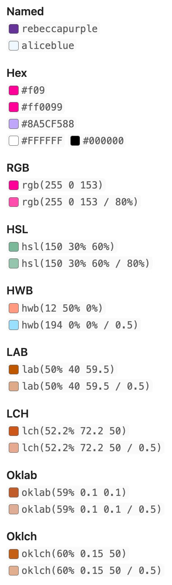

# Obsidian CSS Inlay Colors

Show inline color hints for CSS colors in Obsidian.

To use, just put any valid CSS color syntax in a code block like so: \`#8A5CF5\`.

## Todo

This plugin is still in alpha. Before v1.0.0 is released I want to finish the following features:

- [x] Show colors in reading mode
- [ ] Show colors in live preview mode
- [ ] Edit colors with a color picker in live preview mode

## Development

This project uses Biome and Yarn for linting/formatting and package management. Run `yarn dev` to build on changes.
